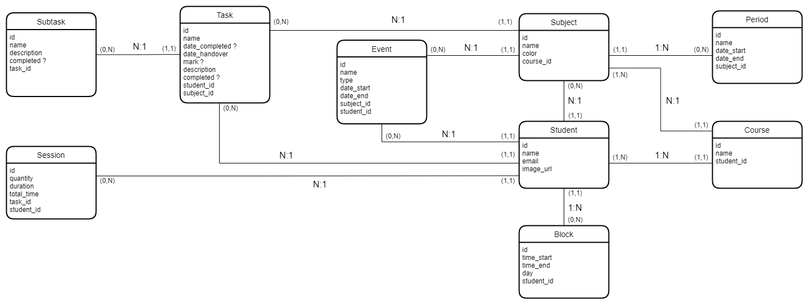

# Powertask Backend Documentation

Here you will find the full documentation for the backend of [Powertask](https://powertask.ml).

## Routes

Here you will find the routes for each request.

|Route                          |Recieves                     |Returns                      |Description                  |
|-------------------------------|-----------------------------|-----------------------------|-----------------------------|
|`'Isn't this fun?'`            |'Isn't this fun?'            |'Isn't this fun?'            |'Isn't this fun?'            |
|`"Isn't this fun?"`            |"Isn't this fun?"            |'Isn't this fun?'            |'Isn't this fun?'            |
|`-- is en-dash, --- is em-dash`|-- is en-dash, --- is em-dash|'Isn't this fun?'            |'Isn't this fun?'            |

## Entity relation diagram

Entity relation diagram for the database.

